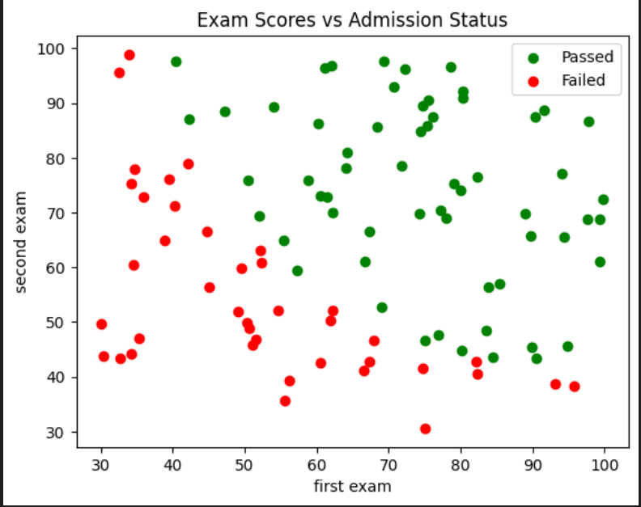
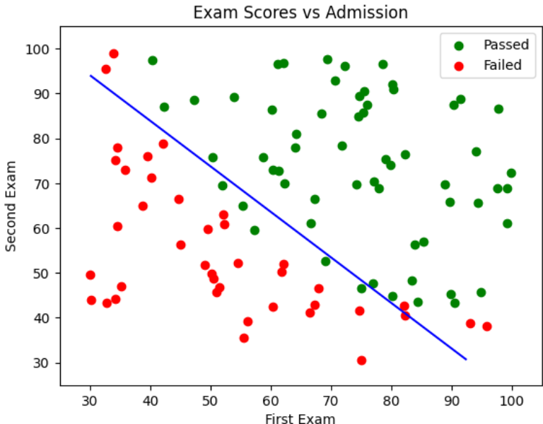
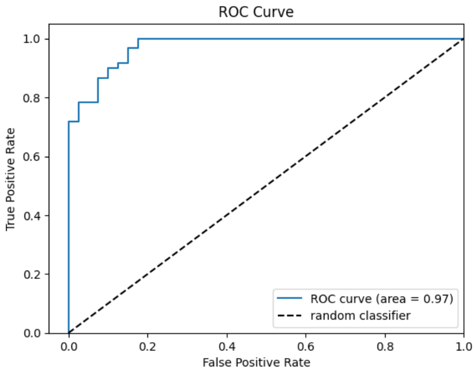
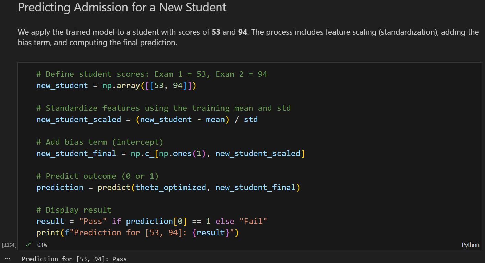

# Student Admission Classification
🎓 Machine learning project that uses logistic regression to predict university admission based on two exam scores

## Table of Contents  

1. [About](#about)  
2. [Features](#features)  
3. [Requirements](#requirements)  
4. [Installation](#installation)  
5. [Usage](#usage)  

---

## About

The **Student Admission Predictor** is a Python-based machine learning project that implements a **Logistic Regression** model from scratch.  
The program predicts whether a student will be admitted to a university based on their scores from two exams.

The project demonstrates the fundamental process of building, training, and evaluating a binary classifier using mathematical optimization.

---

## Features

- **Logistic Regression from Scratch**: Implementation of the core algorithm without high-level ML libraries.  
- **Stochastic Gradient Descent (SGD)**: Efficient optimization process for finding the optimal model parameters.  
- **Feature Standardization**: Pre-processing data using mean and standard deviation for better model convergence.  
- **Probability Prediction**: Calculates the likelihood of admission using the Sigmoid activation function.  
- **Model Evaluation**: Comprehensive performance metrics including **Accuracy (89%)** and **ROC/AUC (0.97)**.  
- **Data Visualization**: Visualizes the decision boundary and the ROC curve to analyze model performance.  

---

## Requirements

- **Python 3.x**: The core programming language used for the project.  
- **Jupyter Notebook environment**: VS Code (with Jupyter extension), JupyterLab, or Google Colab to run the `.ipynb` file.  
- **NumPy**: For numerical computations and matrix operations.  
- **Pandas**: For data manipulation and loading the dataset.  
- **Matplotlib**: For generating graphs and visualizing the decision boundary.  
- **Scikit-learn**: Used for calculating the ROC curve and AUC metrics.  
- **Git:** (to clone the repository)  

---
## Installation

### 1. Clone the repository
```bash
git clone https://github.com/Amit-Bruhim/Student-Admission-Classification.git
```

### 2. Navigate into the project folder
```bash
cd Student-Admission-Classification
```

### 3. Install required libraries
```bash
pip install numpy pandas matplotlib scikit-learn
```

### 4. Open and Run the Notebook
Open the file `src/logistic_regression_admission.ipynb` using VS Code or upload it to Google Colab.  

> **Note:** If using Google Colab, make sure to upload the dataset from the `data` folder as well.

You can then click **"Run All"** to execute the training and see the results.

*Tip: You don't have to run the code to see the results; you can simply scroll through the notebook to view the pre-saved outputs and graphs.*

---

## Usage

The **Student Admission Predictor** allows you to analyze student data and test the model's performance through several visual and interactive steps:

### 1. Initial Data Visualization
Before training, you can view the distribution of admitted versus non-admitted students based on their exam scores.


### 2. Decision Boundary
Once the Logistic Regression model is trained using SGD, the program generates a decision boundary that separates the two classes.


### 3. Model Evaluation (ROC & AUC)
You can evaluate the model's classification power by analyzing the ROC Curve and the final AUC score (0.97).


### 4. Interactive Prediction
You can manually test the model with your own custom scores by modifying the values in the prediction cell.


> **How to test:** Replace the numbers **94** and **53** in the code with your own exam scores to see the admission probability for a specific student.

---